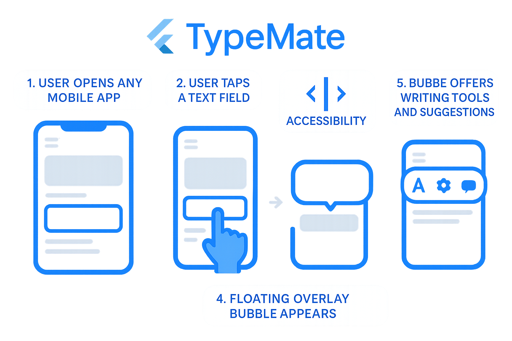

# TypeMate

A Flutter plugin for system-wide writing assistance with overlay bubbles that appear when typing in text fields across all applications.



## Features

🔵 **System-wide overlay** - Works across all Android apps  
📱 **Text field detection** - Automatically detects when you focus on text fields  
✍️ **Writing assistance** - Provides spell check and grammar fix options  
🔐 **Permission management** - Handles overlay and accessibility permissions  
⚡ **Foreground service** - Runs reliably in the background  
🎨 **Customizable** - Configure bubble appearance and behavior  

## Platform Support

| Platform | Support |
|----------|---------|
| Android  | ✅ Full support |
| iOS      | ❌ Not supported (iOS limitations) |
| Web      | ❌ Not applicable |
| Desktop  | ❌ Not supported |

## Getting Started

### Installation

Add this to your package's `pubspec.yaml` file:

```yaml
dependencies:
  type_mate: ^1.0.0
```

### Android Setup

1. **Add permissions to your `android/app/src/main/AndroidManifest.xml`:**

```xml
<uses-permission android:name="android.permission.SYSTEM_ALERT_WINDOW" />
<uses-permission android:name="android.permission.FOREGROUND_SERVICE" />
<uses-permission android:name="android.permission.BIND_ACCESSIBILITY_SERVICE" />
```

2. **Add services to your `AndroidManifest.xml` inside the `<application>` tag:**

```xml
<!-- Overlay Service -->
<service
    android:name="com.ratulhasanruhan.type_mate.OverlayService"
    android:enabled="true"
    android:exported="false"
    android:foregroundServiceType="mediaProjection" />

<!-- Accessibility Service -->
<service
    android:name="com.ratulhasanruhan.type_mate.TextAccessibilityService"
    android:enabled="true"
    android:exported="true"
    android:permission="android.permission.BIND_ACCESSIBILITY_SERVICE">
    <intent-filter>
        <action android:name="android.accessibilityservice.AccessibilityService" />
    </intent-filter>
    <meta-data
        android:name="android.accessibilityservice"
        android:resource="@xml/accessibility_service_config" />
</service>
```

## Usage

### Basic Usage

```dart
import 'package:type_mate/type_mate.dart';

class MyApp extends StatefulWidget {
  @override
  _MyAppState createState() => _MyAppState();
}

class _MyAppState extends State<MyApp> {
  @override
  void initState() {
    super.initState();
    _setupTypeMate();
  }

  Future<void> _setupTypeMate() async {
    // Initialize the plugin
    await TypeMate.instance.initialize();
    
    // Listen to text field focus events
    TypeMate.instance.textFieldFocusedStream.listen((_) {
      print('Text field focused in external app');
    });
    
    // Quick setup with all necessary steps
    final result = await TypeMate.instance.quickSetup();
    if (result['serviceStarted'] == true) {
      print('TypeMate is ready!');
    }
  }
}
```

### Advanced Usage

```dart
// Check permissions
bool hasOverlayPermission = await TypeMate.instance.checkOverlayPermission();
bool hasAccessibilityService = await TypeMate.instance.checkAccessibilityService();

// Request permissions
if (!hasOverlayPermission) {
  await TypeMate.instance.requestOverlayPermission();
}

if (!hasAccessibilityService) {
  await TypeMate.instance.openAccessibilitySettings();
}

// Start/Stop overlay service
await TypeMate.instance.startOverlayService();
await TypeMate.instance.stopOverlayService();

// Test the overlay
await TypeMate.instance.testOverlay();

// Get comprehensive status
Map<String, dynamic> status = await TypeMate.instance.getStatus();
print('Status: $status');
```

### Configuration

You can customize the overlay behavior using `OverlayConfig`:

```dart
final config = OverlayConfig(
  autoShow: true,
  autoHideDuration: 3000, // milliseconds
  enableVibration: false,
  bubbleSize: 56.0,
  bubbleOpacity: 0.9,
  enableSpellCheck: true,
  enableGrammarCheck: true,
  initialX: 100,
  initialY: 200,
);

// Use config when starting the service (planned for future versions)
```

## How It Works

TypeMate consists of three main components:

1. **Flutter Plugin Interface** - Provides Dart API for controlling the overlay
2. **Overlay Service** - Android foreground service that displays the bubble
3. **Accessibility Service** - Detects text field focus events across all apps

### Architecture Flow

```
User types in any app
        ↓
Accessibility Service detects text input
        ↓
Triggers Overlay Service
        ↓
Bubble appears with writing assistance options
        ↓
User can check spelling/grammar or close bubble
```

## Permissions Required

### Overlay Permission (SYSTEM_ALERT_WINDOW)
- **Purpose**: Allows the app to draw over other applications
- **User Action**: Must be granted manually in Android settings
- **Automatic Request**: Plugin can open the settings page

### Accessibility Service (BIND_ACCESSIBILITY_SERVICE)
- **Purpose**: Detects text field focus events across all applications
- **User Action**: Must be enabled manually in Android Accessibility settings
- **Automatic Request**: Plugin can open the accessibility settings page

## Example App

The plugin comes with a complete example app that demonstrates all features:

```bash
cd example
flutter run
```

The example app includes:
- Permission status checking
- Quick setup functionality
- Manual service control
- Test overlay feature
- Live status updates

## API Reference

### TypeMate

Main plugin class providing all functionality.

#### Methods

| Method | Return Type | Description |
|--------|-------------|-------------|
| `initialize()` | `Future<bool>` | Initialize the plugin |
| `checkOverlayPermission()` | `Future<bool>` | Check if overlay permission is granted |
| `requestOverlayPermission()` | `Future<void>` | Request overlay permission |
| `checkAccessibilityService()` | `Future<bool>` | Check if accessibility service is enabled |
| `openAccessibilitySettings()` | `Future<void>` | Open accessibility settings |
| `startOverlayService()` | `Future<void>` | Start the overlay service |
| `stopOverlayService()` | `Future<void>` | Stop the overlay service |
| `testOverlay()` | `Future<void>` | Show test bubble for 3 seconds |
| `quickSetup()` | `Future<Map<String, bool>>` | Perform complete setup |
| `getStatus()` | `Future<Map<String, dynamic>>` | Get comprehensive status |

#### Streams

| Stream | Type | Description |
|--------|------|-------------|
| `textFieldFocusedStream` | `Stream<void>` | Notifies when text fields are focused |
| `textFieldUnfocusedStream` | `Stream<void>` | Notifies when text fields lose focus |

## Troubleshooting

### Common Issues

**Bubble not appearing:**
1. Check if overlay permission is granted
2. Verify accessibility service is enabled
3. Ensure the overlay service is running
4. Try the test overlay function

**Accessibility service not working:**
1. Disable and re-enable the service in Android settings
2. Restart the app
3. Check Android logs for accessibility events

**Permission requests failing:**
1. Ensure your app targets API level 23 or higher
2. Check if the device supports overlay permissions
3. Try manually granting permissions in Android settings

### Debugging

Enable verbose logging to see what's happening:

```dart
// Check status regularly
Timer.periodic(Duration(seconds: 5), (timer) async {
  final status = await TypeMate.instance.getStatus();
  print('TypeMate Status: $status');
});
```

## Limitations

- **Android Only**: iOS doesn't allow system-wide overlays for security reasons
- **Manual Permissions**: Users must manually grant overlay and accessibility permissions
- **Android Version**: Requires Android API level 21+ for overlay functionality
- **Performance**: May affect battery life when running continuously

## Contributing

Contributions are welcome! Please read our contributing guidelines and submit pull requests to help improve TypeMate.

## License

This project is licensed under the MIT License - see the [LICENSE](LICENSE) file for details.

## Acknowledgments

Based on the focus_bubble project architecture and inspired by system-wide writing assistance tools.

---

## 🚀 Happy Coding with TypeMate!

If you find this plugin useful, please consider giving it a star ⭐ on GitHub and sharing it with the Flutter community!